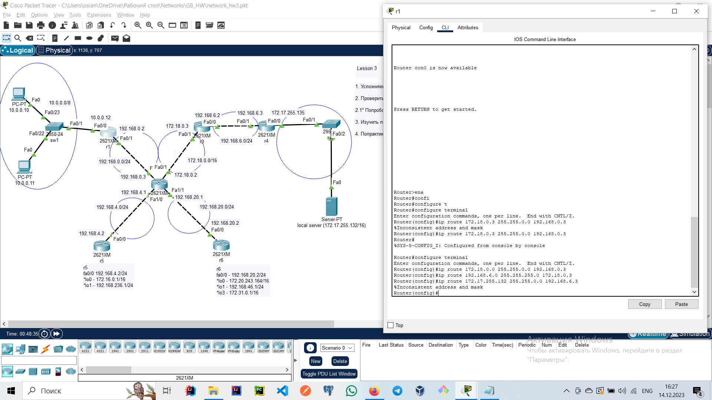
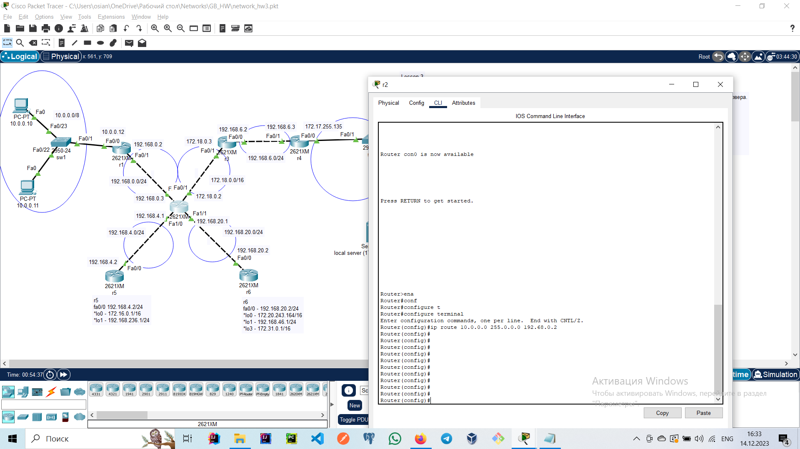
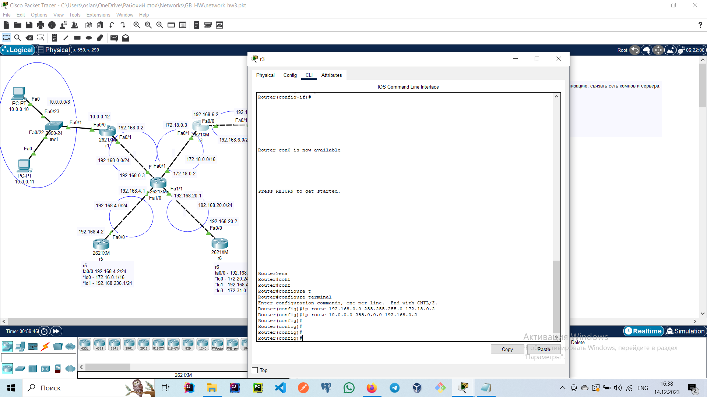
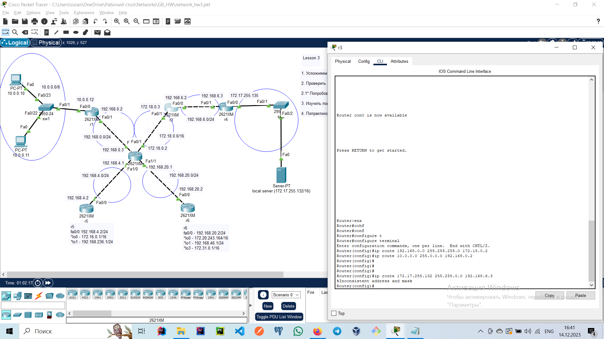
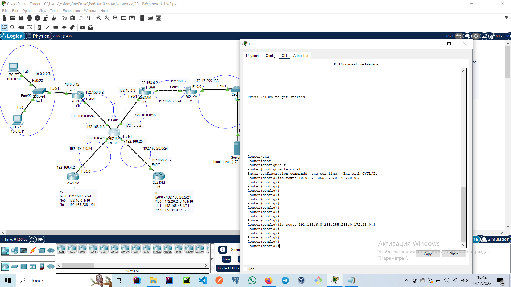
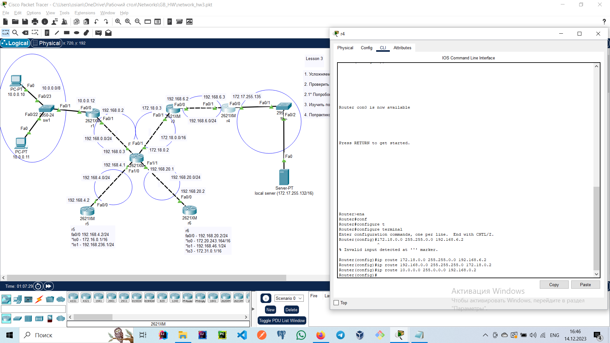
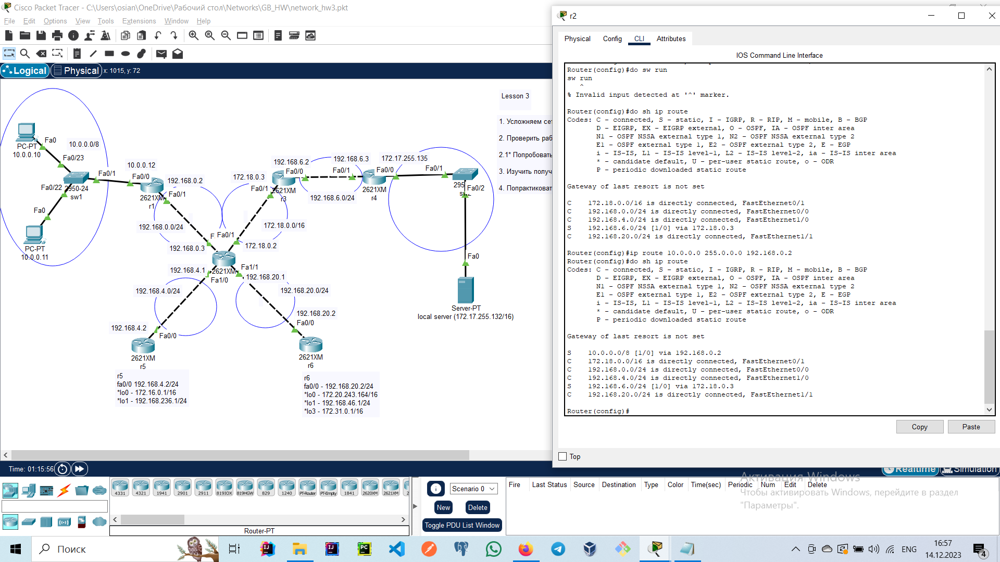
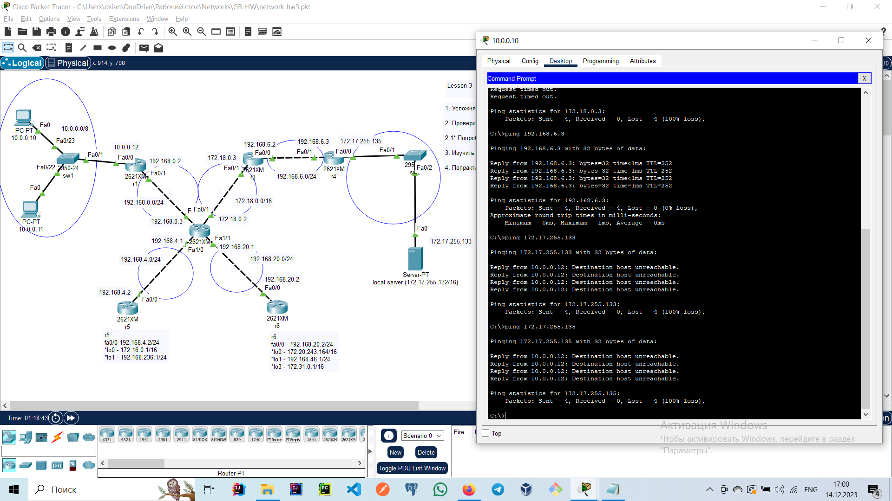
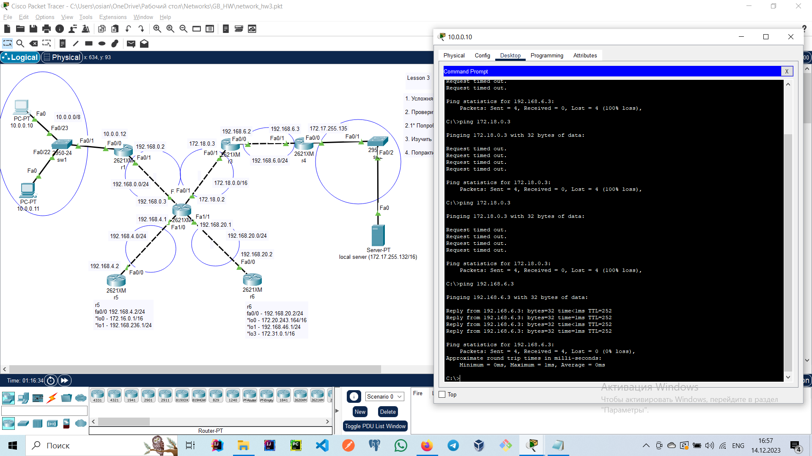

# Задание
1. Усложняем сеть из предыдущего домашнего задания. Используя только статическую маршрутизацию, связать сеть компов и сервера.

2. Проверить работоспособность сети командой ping с компов до сервера и обратно.

3. Изучить получившиеся таблицы маршрутизации.

# Решение

Достучаться до сервера у меня так и не получилось так как в конфигах роутера не прописывался адрес сервера после уже соединеных роутеров

Остальное решено:

